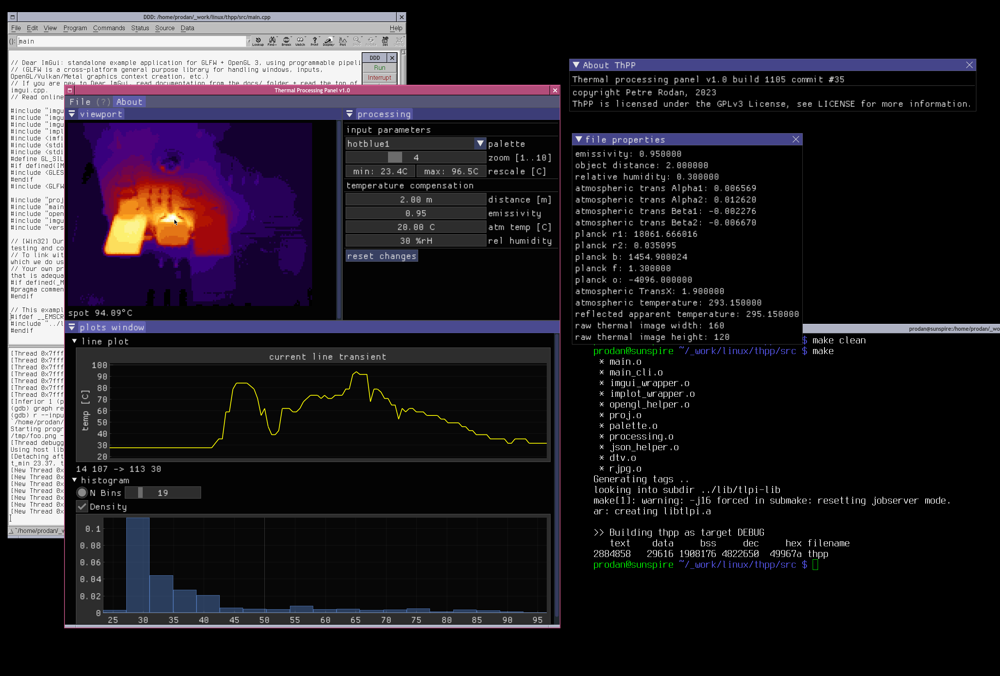

<a href="https://scan.coverity.com/projects/rodan-thpp">
  
</a>

## ThPP

Thermal processing panel is viewer/analyzer of thermal images. It aims to be a rewrite of a project of mine from the 2000s with the same name hosted on sourceforge. The old project was Windows 95-XP oriented and it was written in Borland C++. This new one's target is mostly linux use and it attempts to also support radiometric jpeg images generated by a Flir camera.



```
 source:        https://github.com/rodan/thpp
 author:        Petre Rodan <2b4eda@subdimension.ro>
 license:       GNU GPLv3

graphical user interface based on Dear ImGui
 source:        https://github.com/ocornut/imgui
 author:        Aymar Cornut
 license:       MIT

png decode/encode functionality provided by
 source:        https://github.com/lvandeve/lodepng
 author:        Lode Vandevenne
 license:       zlib (GPL compatible)

tiff decode/encode functionality provided by
 source:        https://github.com/jkriege2/TinyTIFF
 author:        Jan W. Krieger
 license:       LGPL-3.0

error checking based on the Linux Programming Interface book's library
 source:        https://nostarch.com/tlpi/
 author:        Michael Kerrisk
 license:       GNU GPLv3
```

### git clone

this repository is using a few submodules that will get linked into the final binary.
so when you clone the repo make sure you also retrieve the submodules, like so:

```
git clone --recurse-submodules git@github.com:rodan/thpp.git
```

### Functionality

currently supported image formats:

camera | image type | image encoding
--- | --- | ---
Flir ThermaCAM E25 | radiometric JPG 160x120 | png inside jpeg exif, 16bpp
Flir E5 | radiometric JPG 120x90, 320x240 | png inside jpeg exif, 16bpp
Flir SC660 | radiometric JPG 640x480 | tiff inside jpeg exif, 16bpp
Irtis 200, 2000+ | ver2, ver3 DTV files, single frame | raw 8bpp, raw 16bpp

currently supported functions:

image type | export to png | palette change | rescale | zoom
--- | --- | --- | --- | --- 
rJPG| yes | yes | yes | yes
dtv | yes | yes | yes | yes

### Build requirements

the code depends on the headers and libraries provided by the following packages:

 * dev-libs/json-c-0.16 (JSON implementation in C)
 * dev-libs/apr-util-1.6.3 (Apache Portable Runtime Utility Library)
 * media-libs/glfw-3.3.8 (Portable OpenGL FrameWork)
 * media-libs/libglvnd-1.6.0 (The GL Vendor-Neutral Dispatch library)

compilation is simple, one only needs to
```
cd ./src
make
```

### Runtime requirements

 * media-libs/exiftool-12.42

 optional package used for the image restoration algorithm after a 4x rescale:

 * media-gfx/realesrgan-ncnn-vulkan

comparison between 4x zoom with nearest interpolation (left) vs realsr (on the right):


### Usage example

```
./thpp --input ../img/IR_6357.jpg --output /tmp/foo.png -z 4
```

### Testing

the code itself is static-scanned by [llvm's scan-build](https://clang-analyzer.llvm.org/), [cppcheck](http://cppcheck.net/) and [coverity](https://scan.coverity.com/projects/rodan-thpp?tab=overview). Dynamic memory allocation in the PC applications is checked with [valgrind](https://valgrind.org/).


