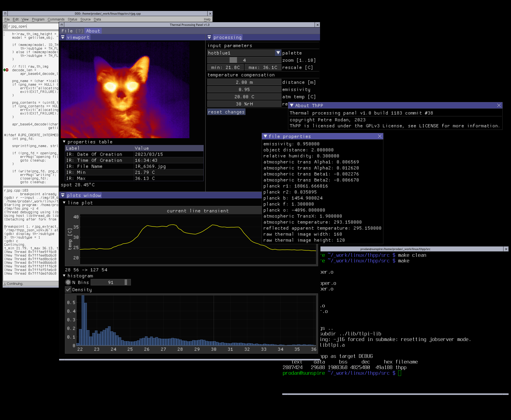

<a href="https://scan.coverity.com/projects/rodan-thpp">
  
</a>

# this project has moved to [codeberg](https://codeberg.org/subDIMENSION/thpp). see you there.

the github repository will be removed on the 14th of March 2025.


## ThPP

Thermal processing panel is viewer/analyzer of thermal images targeted for Linux and BSD. It supports images generated by most Flir and Irtis infrared cameras.
Features include: temperature compensation recalculation, rescaling, zoom based on nearest interpolation or realsr algorithms, HD scale, 14 palettes generated from svg files, histogram, line profile, image overlays for highlighting, level slices, temperature-dependant grown highlights, image and plot export functions.

A full overview of the program capabilities and a sample report can be downloaded from the [release section](https://github.com/rodan/thpp/releases).



```
 source:        https://github.com/rodan/thpp
 author:        Petre Rodan <2b4eda@subdimension.ro>
 license:       GNU GPLv3

graphical user interface based on Dear ImGui
 source:        https://github.com/ocornut/imgui
 author:        Aymar Cornut
 license:       MIT

png decode/encode functionality provided by
 source:        https://github.com/lvandeve/lodepng
 author:        Lode Vandevenne
 license:       zlib (GPL compatible)

tiff decode/encode functionality provided by
 source:        https://github.com/jkriege2/TinyTIFF
 author:        Jan W. Krieger
 license:       LGPL-3.0

error checking based on the Linux Programming Interface book's library
 source:        https://nostarch.com/tlpi/
 author:        Michael Kerrisk
 license:       GNU GPLv3

multi-threading provided by OpenMP
 source:        https://www.openmp.org/

```

conversion algorithm for images generated by Flir IR cameras provided by

Glenn J. Tattersall. (2017, December 3).
Thermimage: Thermal Image Analysis.doi: 10.5281/zenodo.1069704 (URL:
<http://doi.org/10.5281/zenodo.1069704>), R package, &lt;URL:
<https://CRAN.R-project.org/package=Thermimage>&gt;.
[](https://zenodo.org/badge/latestdoi/33262273)

### git clone

this repository is using a few submodules that will get linked into the final binary.
so when you clone the repo make sure you also retrieve the submodules, like so:

```
git clone --recurse-submodules https://github.com/rodan/thpp.git
```

### Functionality

currently supported image formats:

camera | image type | image encoding
--- | --- | ---
Flir b40 | radiometric JPG 120x120 | png inside jpeg exif, 16bps
Flir b50 | radiometric JPG 140x140 | tiff inside jpeg exif, 16bps
Flir i3 | radiometric JPG 60x60 | png inside jpeg exif, 16bps
Flir i5 | radiometric JPG 80x80 | png inside jpeg exif, 16bps
Flir i7 | radiometric JPG 120x120 | png inside jpeg exif, 16bps
Flir i50 | radiometric JPG 140x140 | png inside jpeg exif, 16bps
Flir i60 | radiometric JPG 180x180 | tiff inside jpeg exif, 16bps
Flir AX5 | radiometric JPG 320x256 | tiff inside jpeg exif, 16bps
Flir AX8 | radiometric JPG 80x60 | png inside jpeg exif, 16bps
Flir B20HS | radiometric JPG 320x240 | png inside jpeg exif, 16bps
Flir B335 | radiometric JPG 320x240 | png inside jpeg exif, 16bps
Flir Bertha3 | radiometric JPG 640x480 | tiff inside jpeg exif, 16bps
Flir Duo Pro R| radiometric JPG 640x512 | tiff inside jpeg exif, 16bps
Flir E4 | radiometric JPG 320x240| png inside jpeg exif, 16bps
Flir E5 | radiometric JPG 120x90, 320x240 | png inside jpeg exif, 16bps
Flir E6 | radiometric JPG 160x120 | png inside jpeg exif, 16bps
Flir E8 | radiometric JPG 320x240 | png inside jpeg exif, 16bps
Flir E30 | radiometric JPG 160x120 | tiff inside jpeg exif, 16bps
Flir E30bx | radiometric JPG 160x120 | tiff inside jpeg exif, 16bps
Flir E40 | radiometric JPG 320x240 | tiff inside jpeg exif, 16bps
Flir E40bx | radiometric JPG 160x120 | tiff inside jpeg exif, 16bps
Flir E50 | radiometric JPG 240x180 | tiff inside jpeg exif, 16bps
Flir E60 | radiometric JPG 320x240 | tiff inside jpeg exif, 16bps
Flir E76 | radiometric JPG 320x240 | png inside jpeg exif, 16bps
Flir ONE | radiometric JPG 160x120 | png inside jpeg exif, 16bps
Flir P20 NTSC | radiometric JPG 320x240 | png inside jpeg exif, 16bps
Flir P60 | radiometric JPG 320x240 | png inside jpeg exif, 16bps
Flir P60 NTSC | radiometric JPG 320x240 | png inside jpeg exif, 16bps
Flir P60 PAL | radiometric JPG 320x240 | png inside jpeg exif, 16bps
Flir P640 | radiometric JPG 640x480 | tiff inside jpeg exif, 16bps
Flir P660 | radiometric JPG 640x480 | tiff inside jpeg exif, 16bps
Flir S65 NTSC | radiometric JPG 320x240 | png inside jpeg exif, 16bps
Flir SC660 | radiometric JPG 640x480 | tiff inside jpeg exif, 16bps
Flir T250 Western | radiometric JPG 200x150 | tiff inside jpeg exif, 16bps
Flir T360 Western | radiometric JPG 320x240 | tiff inside jpeg exif, 16bps
Flir T400 | radiometric JPG 320x240 | tiff inside jpeg exif, 16bps
Flir T400 Western | radiometric JPG 320x240 | tiff inside jpeg exif, 16bps
Flir T420 | radiometric JPG 320x240 | png inside jpeg exif, 16bps
Flir T425 | radiometric JPG 320x240 | tiff inside jpeg exif, 16bps
Flir T620bx | radiometric JPG 640x480 | tiff inside jpeg exif, 16bps
Flir T640 | radiometric JPG 640x480 | tiff inside jpeg exif, 16bps
Flir Thermacam B-360 Western | radiometric JPG 320x240 | tiff inside jpeg exif, 16bps
Flir ThermaCAM E25 | radiometric JPG 160x120 | png inside jpeg exif, 16bps
Flir Thermacam E65 | radiometric JPG 160x120 | png inside jpeg exif, 16bps
Flir Thermacam E320 | radiometric JPG 320x240 | png inside jpeg exif, 16bps
Flir Thermacam EX320 | radiometric JPG 320x240 | png inside jpeg exif, 16bps
Flir ThermaCAM P640 | radiometric JPG 640x480 | tiff inside jpeg exif, 16bps
Flir ThermaCAM P660 Western | radiometric JPG 640x480 | tiff inside jpeg exif, 16bps
Flir ThermaCAM SC640 | radiometric JPG 640x480 | tiff inside jpeg exif, 16bps
Flir ThermaCAM SC660 Western | radiometric JPG 640x480 | tiff inside jpeg exif, 16bps
Flir ThermaCAM T-400 | radiometric JPG 320x240 | tiff inside jpeg exif, 16bps
Flir ThermaCAM P660 Western | radiometric JPG 640x480 | tiff inside jpeg exif, 16bps
Flir ThermaCAM SC660 Western | radiometric JPG 640x480 | tiff inside jpeg exif, 16bps
Flir Z-CAMERA | radiometric JPG 80x80 | png inside jpeg exif, 16bps
Irtis 200, 2000+ | ver2, ver3 DTV files, single frame | raw, 8bps 16bps


the images generated by the following cameras can be opened, however a large (over 1dC) temperature delta was observed on the sample images when comparing withthe Flir Thermal Sudio software. this is either due to clipping the temperature limits, applying special calibration coefficients or using a custom formula for calculating the absolute temperature. since all this is done in a black box we might never know, but it would help if you could provide extra sample images.

camera | image type | problem
--- | --- | ---
DJI zenmuse | radiometric JPG 640x512 | temp delta
Flir ONE Pro| radiometric JPG 640x480 | temp delta
Flir P25 PAL | radiometric JPG 320x240 | temp delta
Flir T620 | radiometric JPG 640x480 | unexplained clipping at 160.2dC
Flir T630sc | radiometric JPG 640x480 | unexplained clipping at -26dC
Flir Thermacam E2 | radiometric JPG 160x120 | unexplained clipping at -30dC


currently supported functions:

 * export radiometric file to png
 * get the temperature of any pixel of the image
 * select color presentation based on 13 in-built palettes
 * thermal scale
 * rescale image based on custom temperature limits
 * reconfigure camera data (distance to target, emissivity, atmosperic temperature, relative humidity) for temperature compensation
 * zoom image. 'nearest' interpolation is used by default with optional support for real-ESRGAN if that package is installed on the system
 * temperature histogram
 * thumbnail view of all files in a directory in an image library window
 * customizable file properties table
 * initial support for line profile


keybinds for the viewport:

 * mouse scrollwheel  - vertical scroll of a large image
 * SHIFT + mouse scrollwheel  - horizontal scroll of a large image
 * CTRL + mouse scrollwheel  - zoom image

### Build requirements

the code depends on the headers and libraries provided by the following packages:

 * compiler with OpenMP support
 * media-libs/glfw-3.3.8 (Portable OpenGL FrameWork)

compilation is simple, one only needs to
```
cd ./src
make
```

build scripts are also provided as part of a Gentoo [overlay](https://github.com/rodan/overlay) and a FreeBSD [port](https://github.com/rodan/freebsd-overlay).

### Runtime requirements

 * media-libs/exiftool-12.42

 optional package used for the image restoration algorithm after a 4x rescale:

 * media-gfx/realesrgan-ncnn-vulkan (Gentoo)

 * graphics/realsr-ncnn-vulkan (FreeBSD)

comparison between 4x zoom with nearest interpolation (left) vs realsr (on the right):


### Usage example

```
./thpp --input ../img/IR_6357.jpg --output /tmp/foo.png -z 4
```

### Testing

the code itself is static-scanned by [llvm's scan-build](https://clang-analyzer.llvm.org/), [cppcheck](http://cppcheck.net/) and [coverity](https://scan.coverity.com/projects/rodan-thpp?tab=overview). Dynamic memory allocation in the PC applications is checked with [valgrind](https://valgrind.org/).


